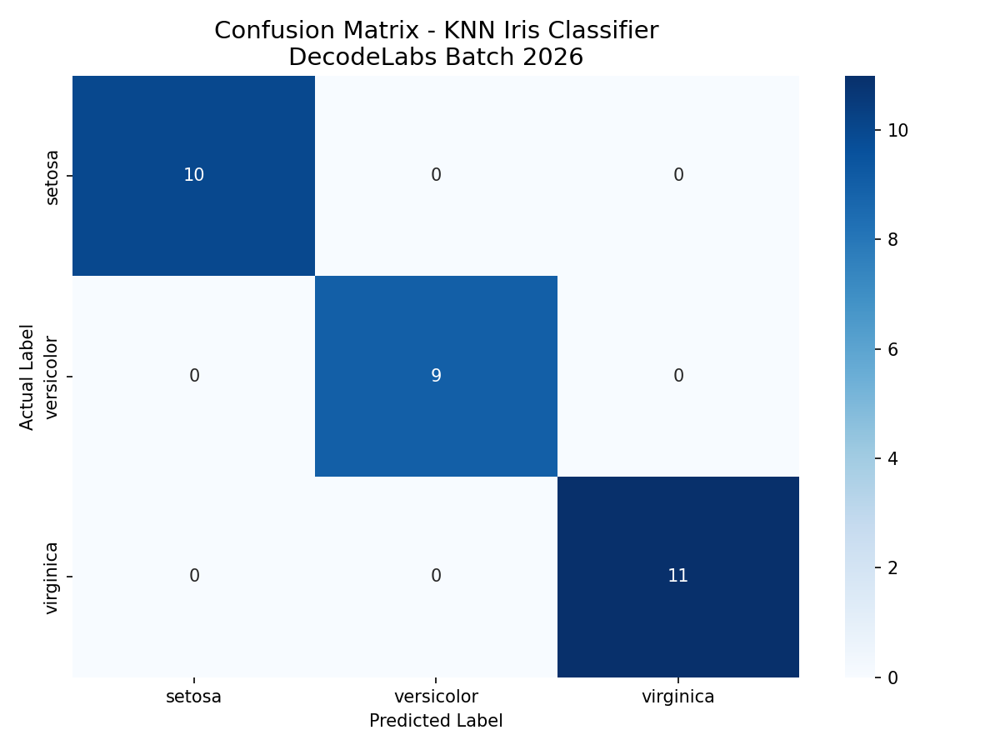
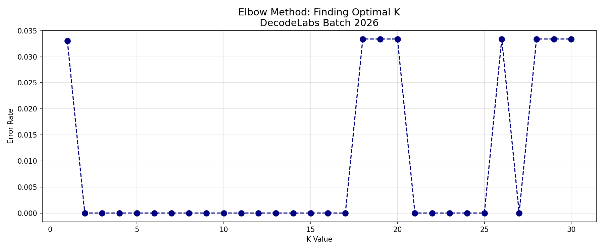

# 🤖 Project 2: Data Classification Using AI
### DecodeLabs Batch 2026 | Industrial Training Program

---

## 📌 Project Overview
This project builds a complete supervised machine learning pipeline 
to classify Iris flower species using the K-Nearest Neighbors (KNN) 
algorithm. It was developed as part of the DecodeLabs Batch 2026 
Industrial Training Program.

---

## 🎯 Problem Statement
Given four measurements of an Iris flower — sepal length, sepal width, 
petal length, and petal width — can a machine accurately identify 
which of three species it belongs to?

**Species:**
- 🌸 Setosa
- 🌺 Versicolor  
- 🌻 Virginica

---

## 🏗️ Architecture: IPO Framework

INPUT → PROCESS → OUTPUT
| Stage | Details |
|-------|---------|
| **INPUT** | Iris Dataset (150 samples, 3 classes, 4 features) + StandardScaler |
| **PROCESS** | 80/20 Train-Test Split + KNN Algorithm (K=5) |
| **OUTPUT** | Confusion Matrix + F1 Score + Elbow Curve |

---

## 📊 Final Results

| Metric | Setosa | Versicolor | Virginica | Overall |
|--------|--------|------------|-----------|---------|
| Precision | 1.00 | 1.00 | 1.00 | **1.00** |
| Recall | 1.00 | 1.00 | 1.00 | **1.00** |
| F1 Score | 1.00 | 1.00 | 1.00 | **1.0000** |
| Accuracy | — | — | — | **100%** |

---

## 📈 Visualizations

### Confusion Matrix

### Elbow Curve — Finding Optimal K

---

## 🔬 Key Findings
- The KNN model achieved **100% accuracy** on the test set
- **F1 Score of 1.0000** confirms no false positives or false negatives
- The **Elbow Method** revealed K=2 through K=17 all achieve zero 
  error rate, proving the model is stable and robust
- **StandardScaler** was critical — it balanced all 4 features to 
  prevent larger-valued features from dominating KNN distance calculations

---

## 🛠️ Tech Stack

| Tool | Purpose |
|------|---------|
| Python 3 | Core programming language |
| Scikit-learn | KNN model, scaling, metrics |
| Pandas | Data manipulation |
| NumPy | Numerical operations |
| Matplotlib | Data visualization |
| Seaborn | Confusion matrix heatmap |
| Google Colab | Development environment |

---

## 📁 Repository Structure

